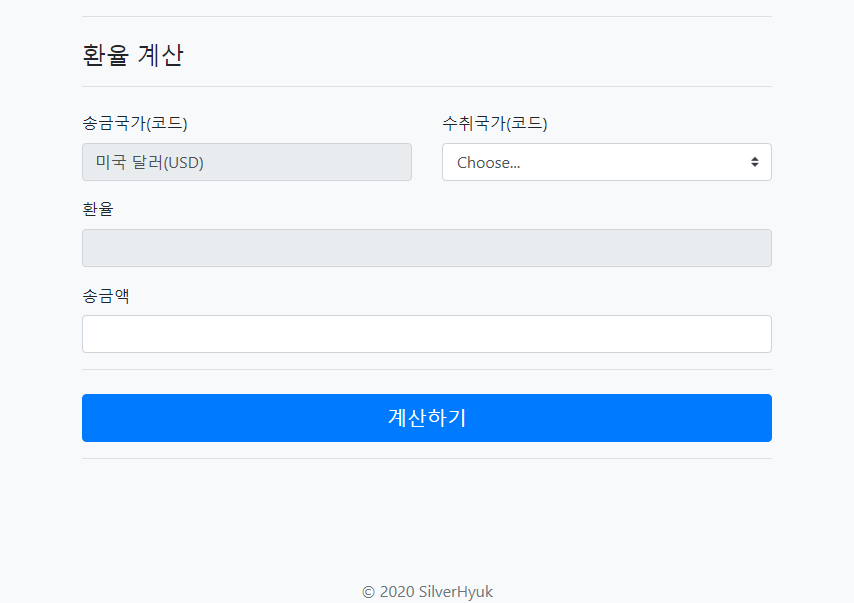
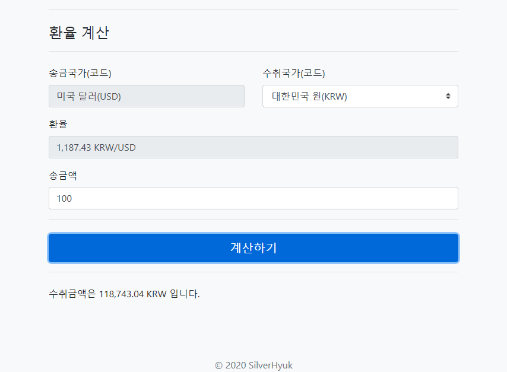
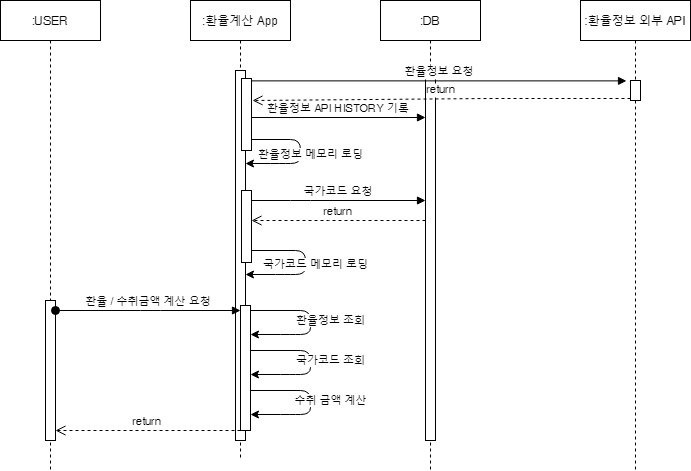

# :chart_with_upwards_trend: Currency Rate Project 

### :seedling: [개요]

- 프로젝트 목적
    - 환율계산 project
    - 수취 국가 선택하고 송금액을 입력하면 수취금액이 자동으로 계산되어짐
- Version 정보
    - Spring Boot 2.3.3
    - Java 1.8.0
    - Gradle 6.4.1
    - Mybatis 3.5

### :seedling: [실행 전 확인 사항]
1. SQL 실행 
    1. /sql/cc.sql 
        - 데이터베이스 및 테이블 생성
    1. /sql/currency_code_data.sql
        - 환율 국가 코드 입력
1. /src/main/resource/application.yml 수정
    1. Database 정보 입력
    1. spring active 환경 선택 
        - local:로컬
        - prod:상용
    1. 송금국가 수정
        - apiCurrencylayer.source
        - API의 무료 플랜에서는 'USD'만 가능
    1. 수취국가 리스트 수정
        - apiCurrencylayer.currencies
        - 콤마(,) 구분자로 국가 코드 추가 또는 변경
            - 예) 싱가폴 달러(SGD) 추가
            - KRW,JPY,PHP --> KRW,JPY,PHP,SGD
            
### :seedling: [화면 접속]
- URL
    - http://{도메인}/currency/main
- 화면
    - 
    - 

### :seedling: [주요 로직]
- 프로그램 시작 시
    - 외부 api에서 환율 정보를 메모리에 적재 후 DB에 기록
    - DB에서 환율 국가 코드를 메모리에 적재
- 스케줄링
    - 1시간마다 외부 api에서 환율정보를 가져와 메모리에 업데이트. (DB에 기록)
- 화면 기능
    - 국가코드 조회
        - 메모리에서 조회
    - 환율정보 조회
        - 메모리에서 조회
    - 수취 금액 계산
- 시퀀스 다이어그램
    - 

### :seedling: [참조]
- 환율API
    - https://currencylayer.com/product
- 국가통화코드
    - https://ko.wikipedia.org/wiki/ISO_4217
   
### :seedling: [To do]
   - 추후 캐시 데이터는 내장메모리에서 REDIS로 옮길 필요가 있음 
       - 이중화시 한곳에 데이터를 바라봐야 하는 이슈
       - 메모리에서 오류 상황 대처 미흡함
   - application.properties 추가 정리 필요
       - 로컬과 상용으로만 분리함
       - 배포 환경에 따라 추가로 고민해 봐야 할 이슈
   - DB 정보 은닉필요
       - 보안 취약
          - 저장소에 접속정보 제거 필요
       - spring cloud : config server 활용 등
   - API 플랜을 Business로 변경 필요
       - 현재는 무료 플랜으로 제한이 걸려있음
           - 1일 1회 변경
           - 250회 호출 제한
            
       
